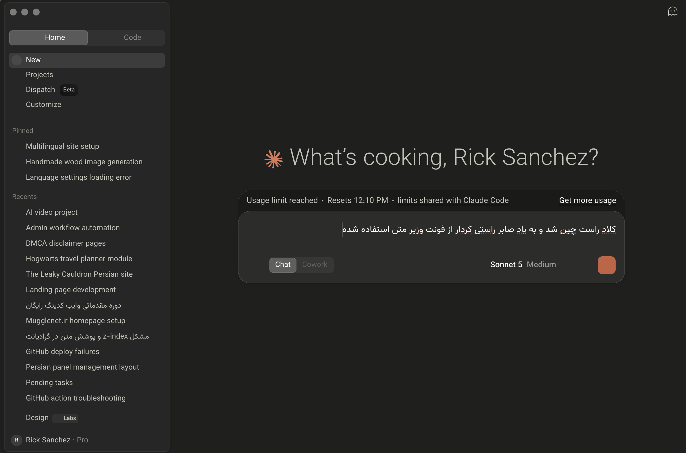

  
  
  <h1>🌟 Claude RTL Patcher (Persian / Arabic / Hebrew)</h1>
  
<strong>الأداة التلقائية الأفضل لدعم النصوص من اليمين إلى اليسار (RTL) والخطوط الجميلة في تطبيق Claude لسطح المكتب.</strong>

  
  
  
  

  ✨ *تم تطبيق خاصية RTL بواسطة Rick Sanchez، وتم استخدام خط Vazirmatn إحياءً لذكرى صابر راستيكردار.* ✨

  [🇺🇸 Read in English](./README.md) | [🇮🇷 نسخه فارسی (Persian)](./README-FA.md) | [🇮🇱 קרא בעברית (Hebrew)](./README-HE.md)

---

هذه أداة مفتوحة المصدر وتلقائية تقوم بإضافة الدعم الكامل للنصوص التي تُكتب من اليمين إلى اليسار **(RTL)** وخط **Vazirmatn** الجميل مباشرة إلى **تطبيق Claude الرسمي لسطح المكتب** (على أنظمة macOS و Windows و Linux).
وتعمل على إصلاح محاذاة النص المكسورة للغات مثل **العربية، والفارسية، والعبرية** حتى تتمكن من الدردشة مع Claude بكل سلاسة.

## 🚀 التثبيت بنقرة واحدة (موصى به)

لست بحاجة إلى تنزيل أو تثبيت أي شيء يدوياً. فقط افتح نافذة الأوامر في نظامك (CMD / PowerShell / Mac Terminal) والصق هذا الأمر السحري:

\`\`\`bash
npx claude-rtl-patcher
\`\`\`

*(تحتوي الأداة على واجهة تفاعلية جميلة ستقوم تلقائياً باكتشاف نظام التشغيل الخاص بك، وإنشاء نسخة احتياطية، وحقن أكواد CSS، وعلى macOS إعادة توقيع التطبيق والتحقق منه ليبقى قابلاً للتشغيل، كل ذلك في ثوانٍ معدودة.)*

بمجرد الانتهاء، أغلق تطبيق Claude بالكامل (`Cmd + Q` أو `Ctrl + Q`) ثم افتحه مرة أخرى.

---

## 🐧 المسارات المخصصة ونظام Linux
إذا قمت بتثبيت Claude في مجلد مخصص، أو كنت تستخدم إصداراً غير رسمي على نظام Linux، قم ببساطة بتوفير مسار التثبيت الخاص بك (أو مباشرة إلى ملف `app.asar`) كـ argument:
\`\`\`bash
npx claude-rtl-patcher /opt/Claude
# أو مباشرة إلى ملف asar:
npx claude-rtl-patcher /home/user/.local/share/Claude/resources/app.asar
\`\`\`

---

## ⏪ كيفية الاستعادة (Restore)
إذا أردت في أي وقت إعادة Claude إلى حالته الأصلية، فقط قم بتشغيل:
\`\`\`bash
npx claude-rtl-patcher --restore
\`\`\`
ستتم استعادة نسختك الاحتياطية الأصلية على الفور.

---

## 🆘 بديل: اطلب من مساعد ذكاء اصطناعي كتابة سكربت مخصص
إذا فشلت الأداة بسبب إصدار غير معروف أو أحدث من Claude Desktop، لا تقلق — تتم استعادة نسختك الاحتياطية تلقائيًا ولا يُترك شيء معطّلاً. يمكنك أيضًا أن تطلب من Claude (أو أي مساعد برمجي آخر) كتابة سكربت مخصص لإصدارك بالتحديد.

انسخ والصق هذا الطلب في Claude:

> "I use claude-rtl-patcher (https://github.com/m4tinbeigi-official/claude-rtl-patcher) to add RTL/Vazirmatn support to my local Claude Desktop install, and it failed to patch my current version. Please write a Node.js script using `@electron/asar` that extracts `app.asar`, injects the same CSS/JS into the `.vite/build`/`.vite/renderer` directories, and repacks it. On macOS it must calculate Electron's integrity hash from the serialized `headerString` returned by `require('@electron/asar').getRawHeader(asarPath)` (not from the whole ASAR), update `ElectronAsarIntegrity` in `Info.plist`, run `/usr/bin/xattr -cr <app-bundle>`, materialize a sanitized entitlement plist that excludes `com.apple.application-identifier`, `com.apple.developer.team-identifier`, and `keychain-access-groups`, ad-hoc sign the complete bundle with `/usr/bin/codesign --force --deep --sign - --entitlements <temporary-plist> <app-bundle>`, and verify it with `/usr/bin/codesign --verify --deep --strict --verbose=2 <app-bundle>`. If patching or signing fails, it must restore the original ASAR and `Info.plist`, recompute integrity, and re-sign and verify the rollback. Please provide the complete Node.js script, and confirm with me before running anything that modifies my installed app."

*راجع السكربت الناتج بنفسك قبل تشغيله — فهو يُعدّل تثبيتك المحلي.*

---

## 🛠️ التقنيات المستخدمة
- **[Node.js](https://nodejs.org/):** المعالج الأساسي.
- **[@electron/asar](https://github.com/electron/asar):** استخراج وإعادة حزم مصادر Electron بأمان دون كسر الـ Native Modules.
- **[Inquirer](https://www.npmjs.com/package/inquirer):** قوائم الأوامر التفاعلية.
- **[Chalk](https://www.npmjs.com/package/chalk) & [Ora](https://www.npmjs.com/package/ora) & [Figlet](https://www.npmjs.com/package/figlet):** واجهة مستخدم ملونة وجميلة مع مؤشرات التحميل.
- **[Crypto]:** إعادة حساب هش سلامة ASAR الخاص بـ Electron نفسه بعد الترقيع (فحص داخلي في Electron، منفصل عن Gatekeeper الخاص بـ macOS)، وإعادة توقيع الحزمة على macOS ليقبلها Gatekeeper.

---

## 🤝 دعوة للمساهمين
نرحب بطلبات السحب (Pull Requests) من الجميع!

---

## ⭐ ادعم المشروع
إذا جعلت هذه الأداة تجربتك مع Claude أفضل، يرجى التفكير في إعطاء **نجمة (⭐)** لهذا المستودع في أعلى الصفحة. هذا يساعد المشروع في الوصول إلى المزيد من المستخدمين!

## 📜 الترخيص
تم النشر بموجب ترخيص **MIT** المفتوح بالكامل. أنت حر في تعديل هذا الكود وتوزيعه واستخدامه تجارياً. 🕊️
